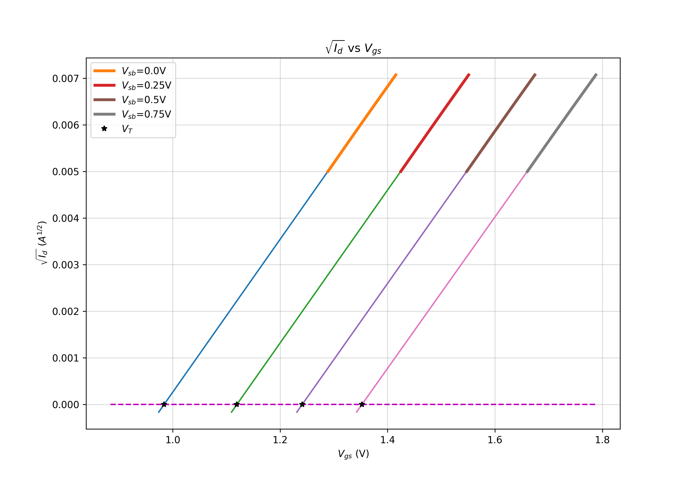
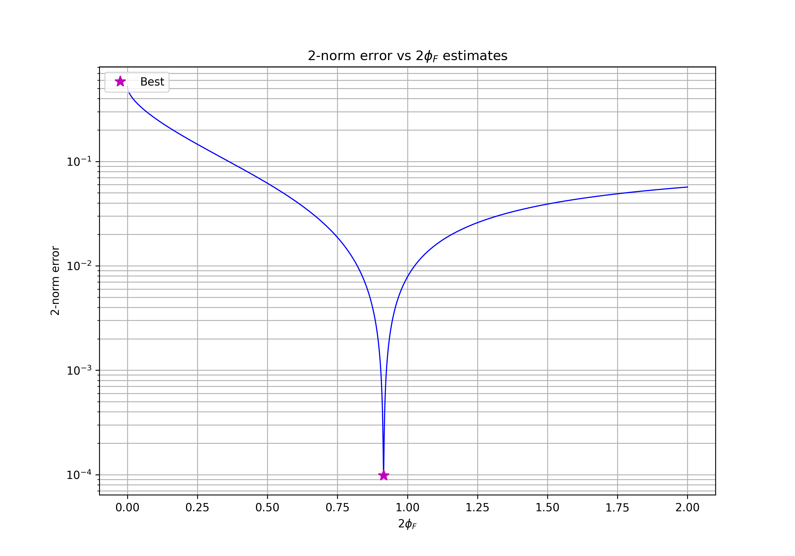
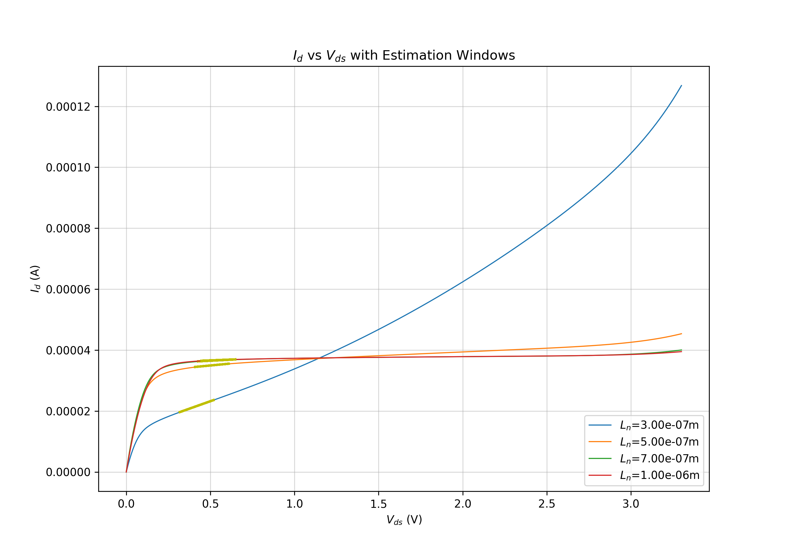
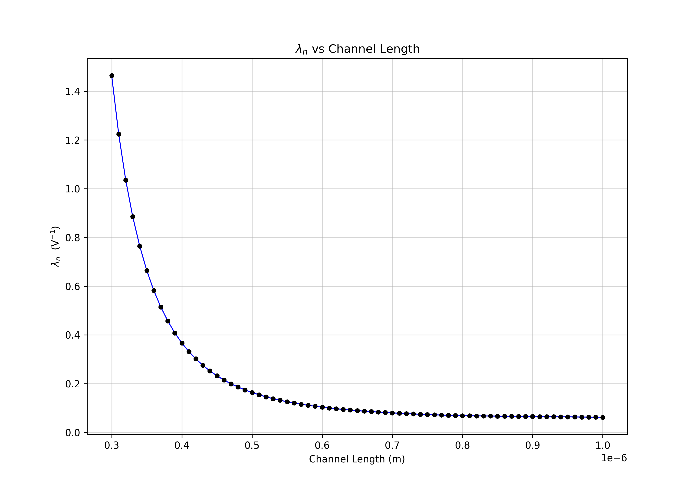
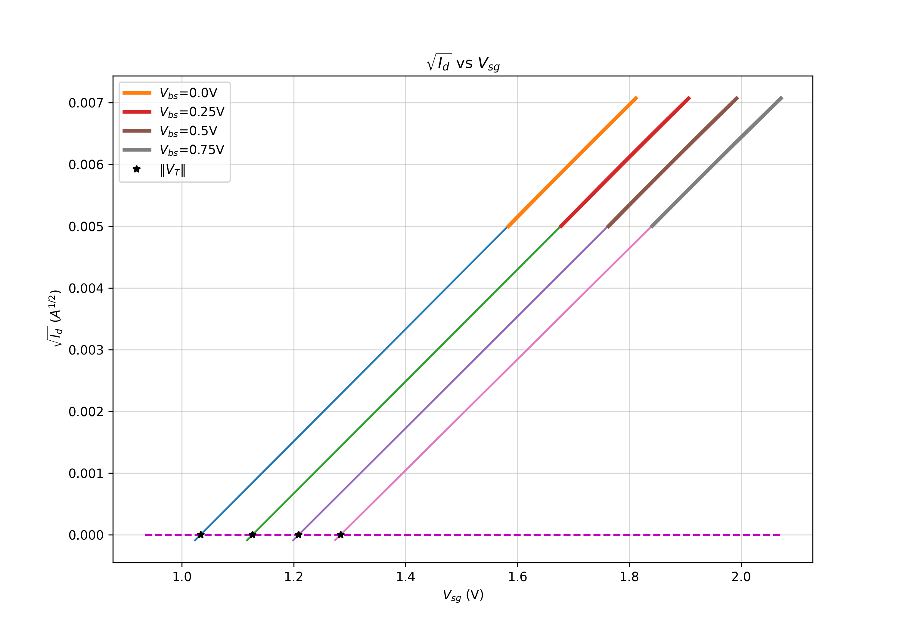
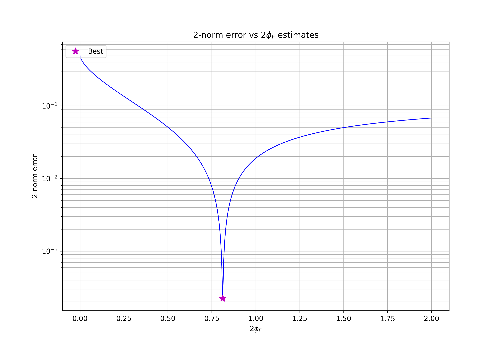
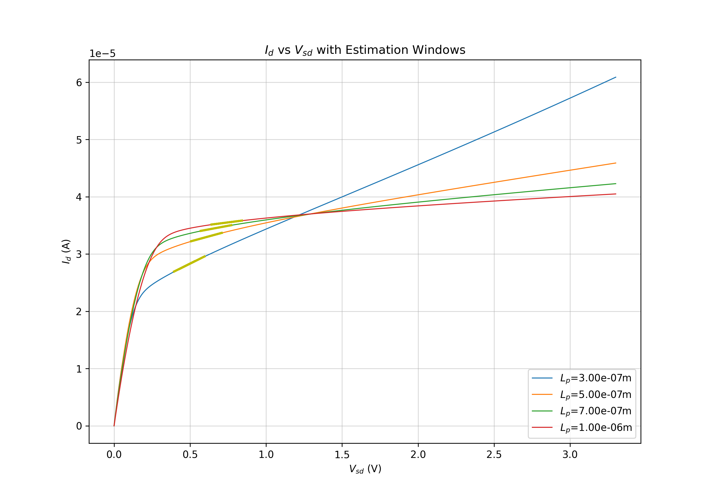
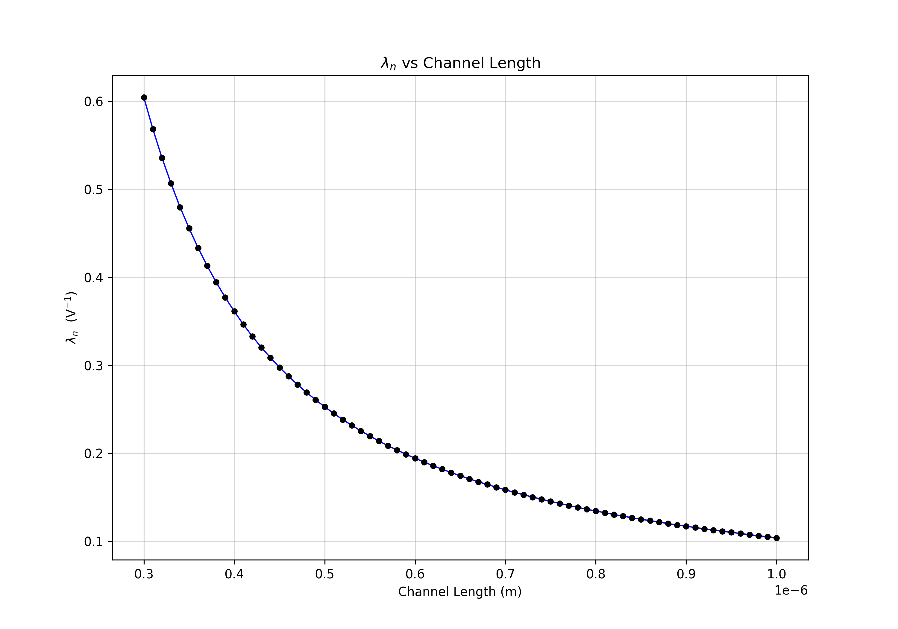

# MOSFET Process Characterization

Extracting simple MOSFET model variables from a complex model file.

See my [blog](https://blog.jeff-m.com) for a brief walkthrough of this process.

These scripts provide more sophisticated methods for estimating the values,
but the core principles are the same as how the blog addresses it.

## Results (Simple)

```
========================================
Processing NMOS
========================================
k'      = 107.564 µA/V^2
V_T0    = 983.833 mV
2phi_F  = 914.891 mV
gamma   = 1.104 V^1/2
lambda (L = 300.00 nm)  = 1.464 V^−1
lambda (L = 500.00 nm)  = 163.631 mV^−1
lambda (L = 700.00 nm)  = 80.140 mV^−1
lambda (L = 1.00 µm)    = 62.217 mV^−1

========================================
Processing PMOS
========================================
k'      = 33.094 µA/V^2
V_T0    = −1.034 V
2phi_F  = 811.881 mV
gamma   = 717.649 mV^1/2
lambda (L = 300.00 nm)  = 604.375 mV^−1
lambda (L = 500.00 nm)  = 252.809 mV^−1
lambda (L = 700.00 nm)  = 158.408 mV^−1
lambda (L = 1.00 µm)    = 103.917 mV^−1
```

## Results (Advanced, lambda ignored for brevity)
```
========================================
Processing NMOS
========================================
k'      = 107.564 µA/V^2
V_T0    = 983.833 mV
2phi_F  = 917.092 mV
gamma   = 1.105 V^1/2

========================================
Processing PMOS
========================================
k'      = 33.094 µA/V^2
V_T0    = −1.034 V
2phi_F  = 817.682 mV
gamma   = 719.212 mV^1/2
```

## Graphs

### NMOS





### PMOS



